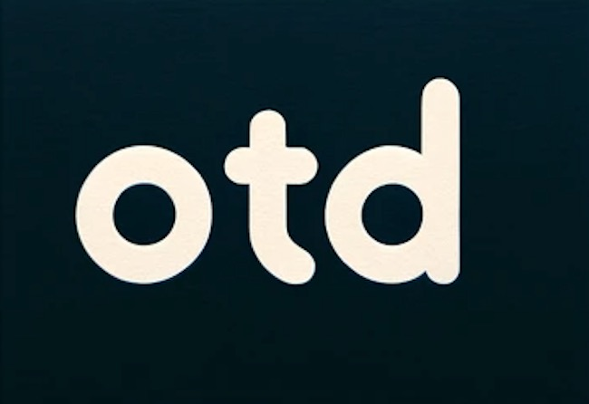

# Welcome to OTD!

## Synopsis
OTD: Your Daily Snapshot into Life's Moments

Introducing OTD (Of The Day), an innovative social app where daily life becomes a shared adventure. At the heart of OTD lies the concept of daily prompts – a series of tags inviting you to capture and share unique aspects of your day.

Whether it's your 'Song of the Day' setting the mood, the 'Sight of the Day' highlighting what caught your eye, or the 'Struggle of the Day' for a dose of real-life authenticity, OTD is your canvas to paint everyday stories. The 'Outfit of the Day' lets fashion enthusiasts showcase their style, while 'Selfie of the Day' is perfect for those personal moments. And for the thinkers, 'Quote of the Day' allows for a shared reflection.

Each of these modes not only adds color to your profile but also connects you with a community sharing similar moments. The unique hashtag system of OTD enables easy navigation through the sea of daily experiences, allowing you to curate your feed and follow threads that resonate with you. It's more than an app – it's a daily journal, a community, and a new way to see the world through the eyes of others. With OTD, every day is a new page in a collective diary of life.

## Meet our Team!

Member | Picture | Contact | Skills |
--- | --- | --- | --- |
Esteban | | ejbh24@stanford.edu|Fullstack/OS/AI Project Experience | 
Anudeep |  |  |  
Babar |  |  |  
Anapaula |  |  |  

## Setup/Instructions for Users:

- Git clone this project
- Download Expo Go
- On Terminal run "npx expo start" in the otd folder (This may involve downloading packages on your terminal to set up compiling projects from expo)
- Scan QR code generated on your terminal
- Register (must meet username/password requirements, it not, you will simply be informed how to adjust your username and password
- Or (if you want to immediately see a feed with friends), you can sign in as (username: anudeep, password: #Anudeep1)

## Features you can Currently Test on our App:
- New users can create an account, choosing username/password. There are certain requirements, very similar to other apps/web accounts
- New users prompted to accept terms and conditions
- Current users can login. Easy if using iPhone save password feature
- On app, users can view and toggle between both friends and global feed. Friends feed is just the people they follow. Global feed is every user including themselves. These posts can be sorted by recency or most upvoted. They can also be filtered by a specific prompt. Posts can be liked and commented on.
- A user can delete their own post.
- Users can go to the post tab, where they can see a prompt of the day, and toggle between a for you and trending list of the different prompts. Trending prompts is all prompts. For you are your favorite prompts. These are ranked in popularity. User can also search for prompts on the top.
- A user can click on a prompt, and then upload a picture from camera or library, type a caption, or both, and post it to the feed.
- A user can search for other existent users on the search tab.
- A user can then click on these profiles, view their account, including first name, last name, bio, username, profile pic, and location follow/unfollow the user, see many followers and following they have, and view a list of who they follow/who follows them.
- A user can view their own profile on the profile tab. They can see their first name, last name, bio, username, location, and profile pic. They can also see how many followers and people they following have. One can click on these numbers to display a list of the people they follow/are followed by. A user can then remove followers and following people they follow if they want.
- A user can also edit their profile if they click on the settings button, specifically change their first/last name, bio, location, password, and set a different profile pic.
- Can view all your own posts on your own page.
- Can  a view all of a user's post on their page.
- Users can and remove their favorite OTDs on the post tab.

## Features we Plan on Implementing Next Quarter to Make this a Company (did not have enough time to add these by deadline):
- 2 warning bugs (they were hard to fix and do not break the app, are just warning that can be dismissed)
- Get access to a better photo drive. Right now photos bigger than 10 mg cannot be uploaded. most photos are find but extremely high resolution like a sun rise with an amazing view may be too big. right now we are using a free cloud drive. we will invest in better recourses as we grow our app.
- When registering, give users the option to select their favorite OTDS.
- For prompts, the number answered count is hardcoded. Update the code so that these are accurate.
- Implement badge functionaility (right now badges are hardcoded and are the same under everyones own profile), didnt have enough time for this
- OTD (Of the Day): Make feeds reset every day. This is actually really easy to do. Our code would just load posts since 12:00 AM. We did not implement this yet because we want the graders to see our posts.
- Implement external sharing for posts.
- Limit users to only one post per prompt per day. User should be allowed to post as many prompts as they want per day though.
- Maybe make it so the user has to engage with prompt of the day to even access their feed???
- Implement linking songs/articles/youtube videos like in imessage (convert link to a clickable thumbnail)
- Show most upvoted post of previous day on top of global feed???? (also do this when filtering by prompts)
- When registering, give users the option to send friend requests to their contacts
